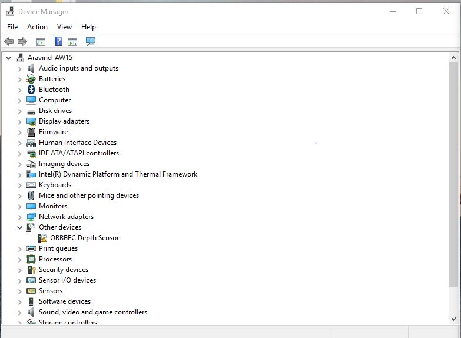
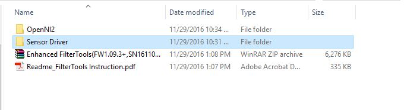
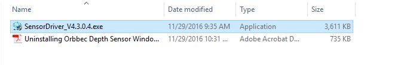
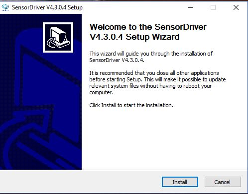
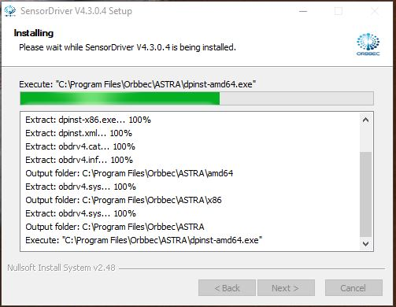
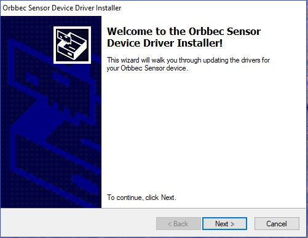
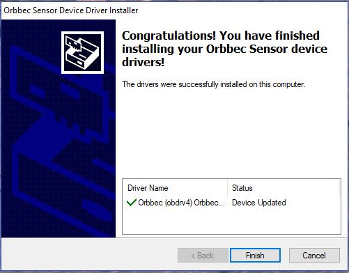
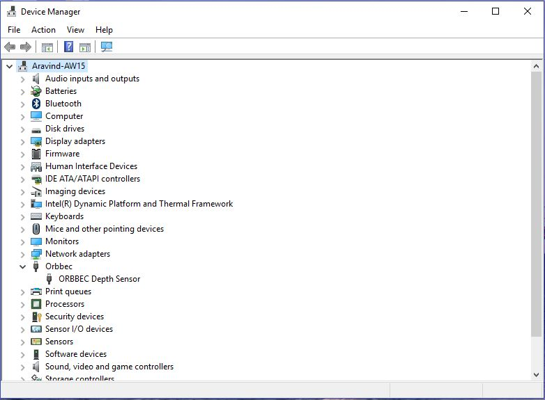

.. _chapter_installation:

Installation
============

Windows
*******
Installation procedure on Windows is straight-forward using an installer.

- Connect the Orbbec Astra camera to one of the USB ports
- Look for the new hardware notification in Device Manager under ``Other devices``

- A look at the contents of the driver

- Open the `Sensor Driver` folder and look for `SensorDriver_V4.3.0.4.exe`

- Double click the .exe and wait for the installer to begin and then click on the `Install` option

- Click `Next`

- Click on `Finish` and the installation is complete

Now, the driver must be visible in `Device Manager`

Linux
*****

Adapted from the Readme file provided by Orbbec.

.. NOTE::
  - For user with ARM based development board:
  - With CPU Structure older than Cortex A17, use OpenNI-Linux-Arm-2.3 Nofilter.tar for better performance.

`Download the OpenNI2 Zip Package from Orbbec <http://www.orbbec3d.net/Tools_SDK_OpenNI/2-Linux.zip>`_
- There are two zip files, one is for a 32bit machine and the other for a 64bit machine.

Let's choose 64bit (x64) and install the driver using an example as follows:

- To run visual samples(e.g., SimpleViewer), you will need ``freeglut3 header and libaries``, please install

::

    $ sudo apt-get install build-essential freeglut3 freeglut3-dev

Check the udev version, Orbbec Driver needs ``libudev.so.1``

If you can't find it then make a symbolic link from ``libudev.so.x.x``, which is usually located at ``/lib/x86_64-linux-gnu`` or ``/lib/i386-linux-gnu``

.. NOTE::
  Type the following commands, only if you could not find the right udev version.

::

    $ ldconfig -p | grep libudev.so.1
    $ cd /lib/x86_64-linux-gnu
    $ sudo ln -s libudev.so.x.x.x libudev.so.1

Next, let's install the OpenNI 2 driver.

- Download the tgz(or zip) file to directory (e.g., /home) and unzip it.

::

		$ cd ~/Downloads
		$ wget http://www.orbbec3d.net/Tools_SDK_OpenNI/2-Linux.zip
		$ unzip 2-Linux.zip
    $ cd 2-Linux
    $ unzip OpenNI-Linux-x64-2.3.zip -d ~/OpenNi
    $ cd ~/OpenNi/OpenNi-Linux-x64-2.3

- Run ``install.sh`` to generate OpenNIDevEnvironment, which contains OpenNI development environment 

::

    $ sudo chmod a+x install.sh
    $ sudo ./install.sh

- Please replug the Orbbec Astra device for usb-register

- Add environment variables

::

    $ source OpenNIDevEnvironment

