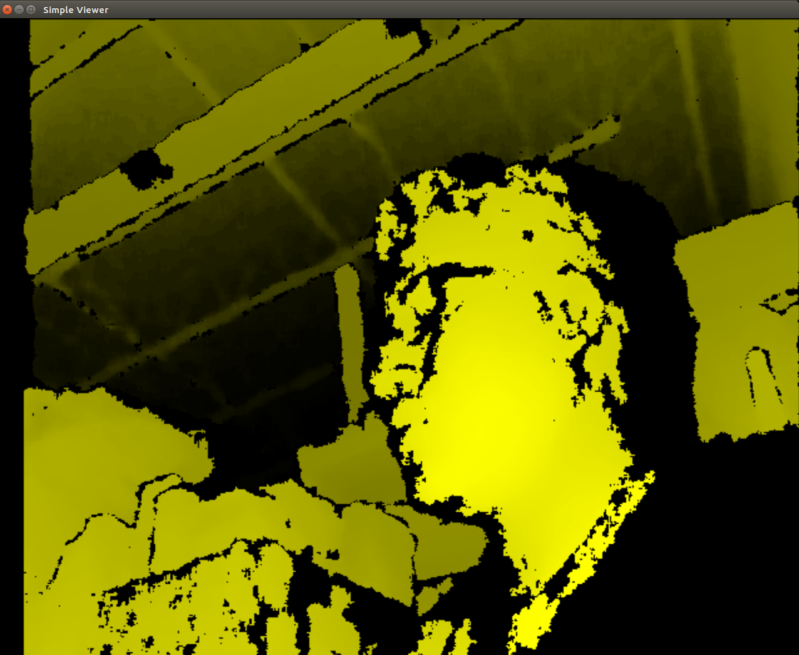
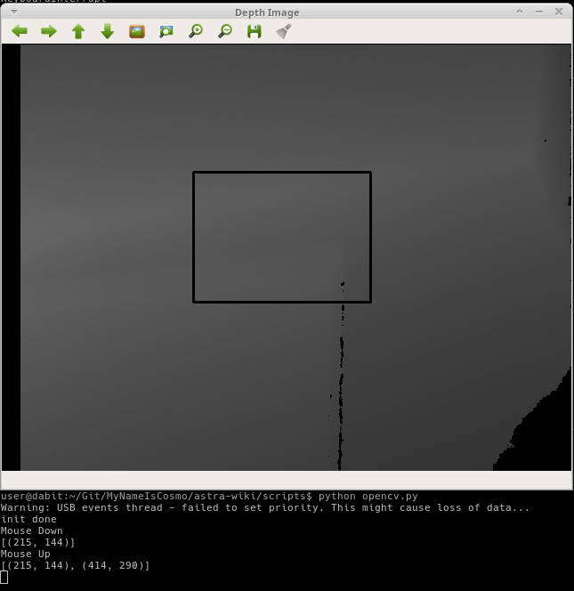

.. _chapter_installation:

Installation
============

Windows
*******
Installation procedure on Windows is straight-forward using an installer.

- Connect the Orbbec Astra camera to one of the USB ports
- Look for the new hardware notification in Device Manager under ``Other devices``

.. image:: _static/noDriverOrbbecDM.JPG

- A look at the contents of the driver

.. image:: _static/contentsOfDriver.JPG

- Open the `Sensor Driver` folder and look for `SensorDriver_V4.3.0.4.exe`

.. image:: _static/runSensorDriver.JPG

- Double click the .exe and wait for the installer to begin and then click on the `Install` option

.. image:: _static/setup1.JPG

.. image:: _static/setup2.JPG

- Click `Next`

.. image:: _static/setup3.JPG

.. image:: _static/setup4.JPG

- Click on `Finish` and the installation is complete

Now, the driver must be visible in `Device Manager`

.. image:: _static/driverInstalled.JPG

Linux
*****

Adapted from the Readme file provided by Orbbec.

.. NOTE::
  - For user with ARM based development board:
  - With CPU Structure older than Cortex A17, use OpenNI-Linux-Arm-2.3 Nofilter.tar for better performance.

'Download the OpenNI2 Zip Package from Orbbec <http://www.orbbec3d.net/Tools_SDK_OpenNI/2-Linux.zip>'_
- There are two zip files, one is for a 32bit machine and the other for a 64bit machine.

Let's choose 64bit (x64) and install the driver using an example as follows:

- To run visual samples(e.g., SimpleViewer), you will need ``freeglut3 header and libaries``, please install

::

    $ sudo apt-get install build-essential freeglut3 freeglut3-dev

Check the udev version, Orbbec Driver needs ``libudev.so.1``

If you can't find it then make a symbolic link from ``libudev.so.x.x``, which is usually located at ``/lib/x86_64-linux-gnu`` or ``/lib/i386-linux-gnu``

.. NOTE::
  Type the following commands, only if you could not find the right udev version.

::

    $ ldconfig -p | grep libudev.so.1
    $ cd /lib/x86_64-linux-gnu
    $ sudo ln -s libudev.so.x.x.x libudev.so.1

Next, let's install the OpenNI 2 driver.

- Download the tgz(or zip) file to directory (e.g., /home) and unzip it.

::

		$ cd ~/Downloads
		$ wget http://www.orbbec3d.net/Tools_SDK_OpenNI/2-Linux.zip
		$ unzip 2-Linux.zip
    $ cd 2-Linux
    $ unzip OpenNI-Linux-x64-2.3.zip -d ~/OpenNi
    $ cd ~/OpenNi/OpenNi-Linux-x64-2.3

- Run ``install.sh`` to generate OpenNIDevEnvironment, which contains OpenNI development environment 

::

    $ sudo chmod a+x install.sh
    $ sudo ./install.sh

- Please replug the Orbbec Astra device for usb-register

- Add environment variables

::

    $ source OpenNIDevEnvironment

Example 1: SimpleViewer
~~~~~~~~~~~~~~~~~~~~~~~

- Build sample(e.g., SimpleViewer)

::

    $ cd Samples/SimpleViewer
    $ make

- Run a sample

::

    $ cd Bin/x64-Release
    $ ./SimpleViewer

- You should now be able to see a GUI window showing the depth stream video. Here is an image showing the GUI window

Example 2: ClosestPointViewer
~~~~~~~~~~~~~~~~~~~~~~~~~~~~~

- Build sample

::

    $ cd Samples/ClosestPointViewer
    $ make

- Run the sample

::

    $ cd Bin/x64-Release
    $ ./ClosestPointViewer

The gif shows the closest point (marked by red and blue points).

.. image:: _static/closestPointViewer.gif

.. NOTE::
  - If the Debian Jessie Lite is used for testing, it may require the following installation for properly start the viewer.

::

    $ sudo apt-get install libgl1-mesa-dri

Example 3: Depth Stream using Python and OpenCV
~~~~~~~~~~~~~~~~~~~~~~~~~~~~~~~~~~~~~~~~~~~~~~~
You can view depth data in Python from the Orbbec Astra using the OpenNI, OpenCV, and Numpy libraries.
OpenNI is used to communicate with the camera.
Numpy is used to manipulate the data to be displayed in a 2D window
OpenCV is used to display the manipulated depth data.

To start, you should source the Orbbec build environment from earlier:
::

		$ source ~/OpenNi/OpenNI-Linux-x64-2.3/OpenNIDevEnvironment

Now create a new Python file and put the following code in it:

::

		#!/usr/bin/python
		import cv2
		import numpy as np
		from openni import openni2
		from openni import _openni2 as c_api

		# Initialize the depth device
		openni2.initialize()
		dev = openni2.Device.open_any()

		# Start the depth stream
		depth_stream = dev.create_depth_stream()
		depth_stream.start()
		depth_stream.set_video_mode(c_api.OniVideoMode(pixelFormat = c_api.OniPixelFormat.ONI_PIXEL_FORMAT_DEPTH_100_UM, resolutionX = 640, resolutionY = 480, fps = 30))

		# Function to return some pixel information when the OpenCV window is clicked
		refPt = []
		selecting = False

		def point_and_shoot(event, x, y, flags, param):
				global refPt, selecting
				if event == cv2.EVENT_LBUTTONDOWN:
						print "Mouse Down"
						refPt = [(x,y)]
						selecting = True
						print refPt
				elif event == cv2.EVENT_LBUTTONUP:
						print "Mouse Up"
						refPt.append((x,y))
						selecting = False
						print refPt

		# Initial OpenCV Window Functions
		cv2.namedWindow("Depth Image")
		cv2.setMouseCallback("Depth Image", point_and_shoot)

		# Loop
		while True:
				# Grab a new depth frame
				frame = depth_stream.read_frame()
				frame_data = frame.get_buffer_as_uint16()
				# Put the depth frame into a numpy array and reshape it
				img = np.frombuffer(frame_data, dtype=np.uint16)
				img.shape = (1, 480, 640)
				img = np.concatenate((img, img, img), axis=0)
				img = np.swapaxes(img, 0, 2)
				img = np.swapaxes(img, 0, 1)

				if len(refPt) > 1:
						img = img.copy()
						cv2.rectangle(img, refPt[0], refPt[1], (0, 255, 0), 2)

				# Display the reshaped depth frame using OpenCV
				cv2.imshow("Depth Image", img)
				key = cv2.waitKey(1) & 0xFF

				# If the 'c' key is pressed, break the while loop
				if key == ord("c"):
						break

		# Close all windows and unload the depth device
		openni2.unload()
		cv2.destroyAllWindows()

- Run the example code and click + drag on the screen to make a "selection" box. The 2D image coordinates of the selected box are printed to the terminal.

Example 4: Depth Stream using C++
~~~~~~~~~~~~~~~~~~~~~~~~~~~~~~~~~

::

  mkdir build
  cd build
  cmake ..
  make
  ./pcd_write_test
  ./viewer --help
  ./viewer -l
  ./viewer
